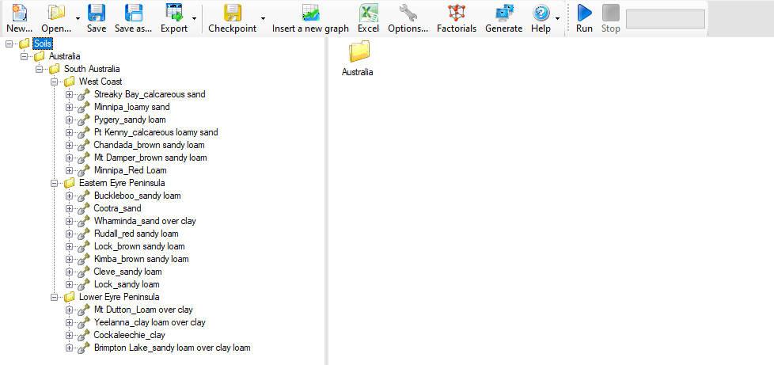

## Process for uploading a soil to APSoil

Merge all your soils into a single APSIM Classic file that can be sent and reviewed by Kristen Verburg (kirsten.verburg@csiro.au). 
This file should look like this:

Important Notes:
- The top level folder should be named "Soils"
- There should be a folder structure seperating the soils into Country, State and Region
- Only soil models should be included, no simulations
- Metadata on the soils should match the structure they are in

Once the soil properties have been reviewed, it can then be sent to Andrew Paroz (andrew.paroz@csiro.au) to be uploaded into the APSoil database.